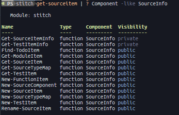
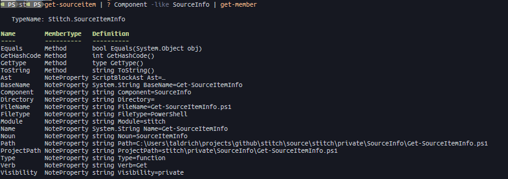
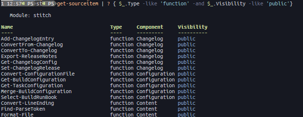
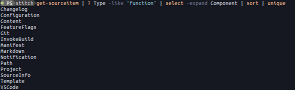

# stitch project

A set of PowerShell functions and Invoke-Build tasks stitched together to aid
the developer.


There is a [story][1] about NASA pens and pencils:

> When NASA started sending astronauts into space, they quickly Discovered that
> ball-point pens would not work in zero Gravity. To combat this problem, NASA
> scientists spent a Decade and $12 billion developing a pen that writes in zero
> Gravity, upside-down, on almost any surface including glass and at
> temperatures ranging from below freezing to over 300 C.
>
> The Russians used a pencil.

***In this analogy, `stitch` is most definitely, the space-pen*** :rocket::black_nib:
[TOC]

## Synopsis

🧵 stitch is a collection of functions and [Invoke-Build][2] tasks designed to
help authors of PowerShell modules.

## Description

`stitch` is a *project management system*.  That means that in addition to
building source files into a module, `stitch` contains functions and tasks for
many other aspects of developing and managing a project.

`stitch` takes inspiration from the java build system [maven][3] and is designed
to help manage:

- Source code
- Builds
- Testing
- Documentation
- Reporting
- Dependencies
- Source Code Management / Version Control
- Releases
- Publishing / Distribution

## Overview

stitch is both a module, and a set of Invoke-Build tasks.  If you are already
using a build script of your own, then you can still use functions from the
stitch *module* without having to change your existing process.  Or, if you have
a set of tasks already, you can run those with the stitch build driver without
needing to use any of the ones that come with `stitch`

### Build system

#### Phases

On top of "regular" Invoke-Build tasks, `stitch` adds the concept of a *build
phase*... these are the "common" (usually multi-step) tasks that we all have in
our build scripts like:

- **Build**: Create a module file (.psm1) and manifest (.psd1) from the files in
  the source directory.
- **Test**: Run Pester tests on the source files
- **Package**: Create a nuget package file (.nupkg)
- **Publish**: Post the package to a repository such as [PSGallery][4]

(for a full list of phases, see the [wiki][6])

Each phase is made up of one or more smaller "atomic" tasks, and the phases
are chained together to follow a natural progression in the "life cycle" of the
project. For an excellent introduction to this concept see [this article][7] from
the maven project and the [wiki][6] of this repo for `stitch` specific details.

#### Profiles

Another concept built on top of Invoke-Build tasks (and phases) is the build
*profile*.  There are many ways to use profiles but two of the most common are:

1. Maintaining two or more "products" in the same code-base, such as a module
   and a website.
1. Maintaining two or more "environments" in the same code-base, such as "dev",
   "qa", "prod", etc.

Each profile can make use of the same tasks (or not), and the same parameters
(or not); it is a flexible way to define multiple "builds" of a single project.

(for a detailed explanation of build profiles, including examples, see the [wiki][6])

### Module functions

#### Working with source code

There are several functions that turn files in the project's source directory
into objects on the pipeline:


Each item has a rich set of properties for use in your scripts and tasks:


Some examples of things you can do with this information:

1. Build a list of functions to be exported:
   
1. Generate a list of components in your module
   
1. Create Pester test files from your source file

   ```powershell
   get-sourceitem | ? Name -like Get-SourceItem | New-TestItem
   ```

   ***Disclamer***: `stitch` has a few templates that are based on the [EPS][5]
   module... they work ok for simple things, but I'm looking for a suitable
   replacement.

As you can see, there are a lot of useful things you can do with the
`sourceiteminfo` object.

Head over to the [wiki][6] to see more.

### Invoke-Build tasks


#### task locations

`stitch` will look in multiple other locations for the tasks definitions:

- The given build profile directory
- The user's `~/.stitch` directory
- The stitch module`s installed directory

Each layer "overlays" the one below it, so that if a task in the build profile
directory has the same name as a task in the module's directory, it will be run
instead of the module's.

Additionally, tasks can be included or excluded by name at run-time using the
configuration file or the command line parameters.

#### task runbook

`stitch` phases and tasks are defined in a "special" build script called the
*runbook*.

To make it easier to create and modify phases and tasks, `stitch` adds
additional aliases to your build that let you control tasks in an easy-to-read
way, creating a build [DSL][8]

currently, there are three of these DSL words:

- **jobs**: A flexible way to add subtasks (jobs) to any phase or task

  ```powershell
  Build | jobs write.module, write.manifest
  ```

- **before**: Set a task to run before another

  ```powershell
  Clean | before Build
  ```

- **after**: Set a task to run after another

  ```powershell
  add.footer | after create.document
  ```

[1]: https://www.snopes.com/fact-check/the-write-stuff/
[2]: https://github.com/nightroman/Invoke-Build
[3]: https://maven.apache.org/guides/getting-started/index.html#what-is-maven
[4]: https://www.powershellgallery.com/
[5]: https://github.com/straightdave/EPS
[6]: https://github.com/aldrichtr/stitch/wiki
[7]: https://maven.apache.org/guides/introduction/introduction-to-the-lifecycle.html
[8]: https://en.wikipedia.org/wiki/Domain-specific_language
